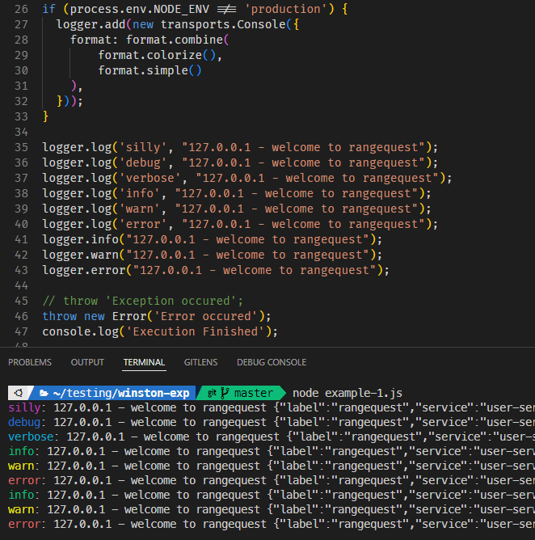

# Winston Experiments

winston is designed to be a simple and universal logging library with support for multiple transports. A transport is essentially a storage device for your logs. Each winston logger can have multiple transports (see: Transports) configured at different levels (see: Logging levels). For example, one may want error logs to be stored in a persistent remote location (like a database), but all logs output to the console or a local file.

https://github.com/winstonjs/winston

# Logging Levels

## (Related: RFC5424 the syslog levels)

The below are the Winston logging levels.

```
{
  error: 0,
  warn: 1,
  info: 2,
  http: 3,
  verbose: 4,
  debug: 5,
  silly: 6
}
```

